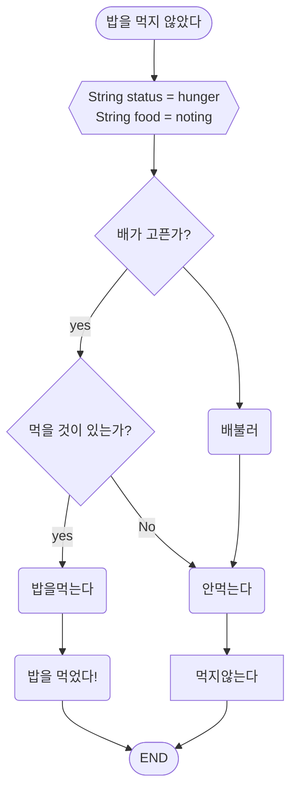

```mermaid
flowchart 
a([밥을 먹지 않았다])
b{{String status = hunger <br> String food = noting}}
c{배가 고픈가?}
d{먹을 것이 있는가?}
e(밥을먹는다)
f(밥을 먹었다!)
g([END])
h(안먹는다)
i[먹지않는다]

a --> b --> c -->|yes| d -->|yes| e --> f --> g
 %%c-->|No| h
 d-->|No| h
h --> i --> g

aa(배불러)
c --> aa --> h

```